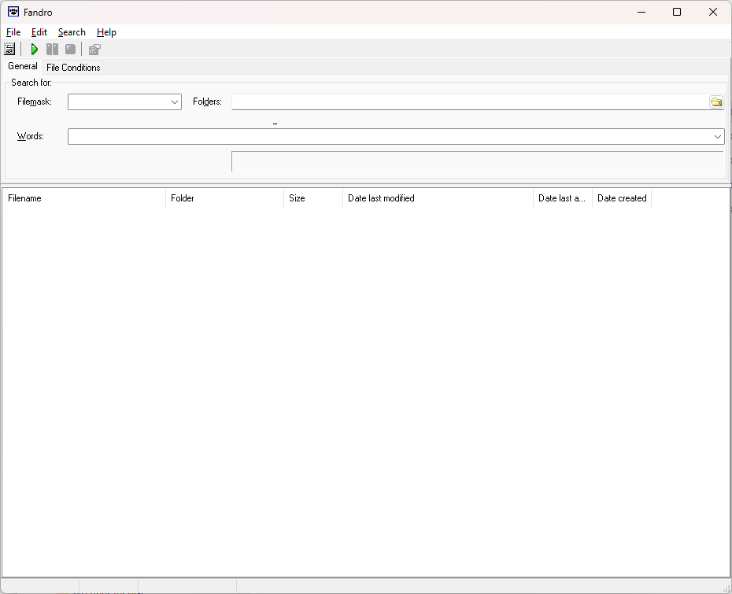

FANDRO

A file search tool for Windows 32-bits, written in Delphi with a sprinkle of
assembly (uppercase comparison).

History

I wrote Fandro in the early days of Windows XP (2005ish): Windows XP had just
launched and as a developer, that OS's search/find tools did not work for me.

Initially I thought of using a commercial/freeware application. Or get 
cygwin to just load up grep: however, you need to do a lot more to find
files that contain words OR have specific file size/were created at
specific dates and times.

The first thing I did was study search algorithms - I ended up looking at
Boyer Moore Horspoole and the rest is history. The initial version used 
Delphi's TStream/TFileStream - and of course I ran into the proverbial
'file size limit'. That's when I threw everything out of the window and
just used memory mapped files. Use those if you work with huge files. You 
won't regret it.

Anyway - many years ago I moved on from Delphi - in the back of my mind
I had always plans to release the code but - now is a good time as I've
been looking at/collecting older code from the proverbial 'dust bin'.

Fandro became popular at several companies that I worked at ("It just works").
I think at one time it became official allowed software at a large world
wide consulting company. Thanks to the ones plugging for it. Sorry - it stil 
does not support 64-bit (and it will most likely never...)

Don't ask me how to compile it. I have no idea anymore and I'm not
ready and willing to open up my oldest Delphi compiler. I loved the language 
and if you do still Delphi, power to you. I would recommend you'd take
on another language tho.


Arthur (March 2023)

And now the original 2005-2008 release notes with tips and tricks!




RELEASENOTES
============

Fandro is a file search tool. I hate Windows XP's new
search tool and I also have a distaste of search tools
that aren't free. Or ripped off 'light' versions of
'professional' ones.

Using Fandro should be straight forward. If you run into
bugs, please e-mail me.

arthur.hoogervorstNOSPAM@gmail.com (remove NOSPAM block).

Fandro's official release site is at
http://hoogervorst.ca/arthur. At this stage I'm considering
open-sourcing Fandro.

PLEASE DO NOT DISTRIBUTE THIS FILE WITHOUT THIS
RELEASENOTES FILE. YOU ARE FREE TO DISTRIBUTE FANDRO
*FREE* OF CHARGE. YOU ARE NOT ALLOWED TO CHARGE FOR
ANY FILE IN THE OFFICIAL RELEASE UNLESS I SAY SO.


You're welcome,


Arthur

TIPS
====

Commandline interface:

```
--dir="C:\", folder to use.
--qry="WORDS TO LOOK FOR", words to look for
--msk="*.EXE", mask to use.
--cmd="[SWC]", combination of SWC (Subfolders, Whole words, Case sensitive]
--mtc="(ANY, ALL, EXACT)", choice of one of the three (example: --mtc="EXACT")
--run  (no options), run immediately.

Full example:

fandro --dir="c:\program files" --msk="*.mp3" --run
```


1.5.0.1
+ Added ShellHook (File Explorer integration).
+ Added RegisterHooks right into Fandro.

AH020610
+ Moved Ints to Int64.
+ Added extra 'open folder item' (CTRL+ALT+E) in Search menu.
+ Added autocompletion in directory box (result of latest JVCL).
+ Compiled against the lastest JVCL
AH072006
+ Add commandline interface.
AH071706
+ Allow Explorer menu access.
AH071606
+ Finally an case sensitive fix. Needed to actually replace some code
  in Finder Object (uppercase chars/data).
AH072705
+ Bug in folder search: add hidden folders too...
+ Bug in fileInuse function (particularly ReadOnly/Hidden flags)
+ Bug in Case Sensitivity. Inverse in uFindThread.

1.0.0.6
+ Official Internet release.


